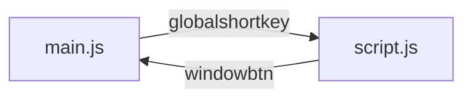

# Приложение таймер

## Для пользователя
Таймер представляет собой оконное приложение с возможностью обратного счёта.

Время регулируется при помощи кнопок + и -

##### Таблица функционала:
| Сочетание клавиш  | Функции|
|:----:|----|
| `ALT + F1`| Старт / Пауза|
| `ALT + F2`| Сброс|

## Для разработчика
> Если вы тут, то вам нужно переписать или добавить новый фунционал в этот "проект"

В проекте используется библиотека: [ElectronJS](https://www.electronjs.org/)

#### Установка проекта

> `git clone https://github.com/yeaahYEAHH/timerOnDesktop.git`

Клонирует файлы проекта в локальную папку для дальнейшей работы

> `npm install`

Установит все необходимые зависимости и библиотеки для работы

#### Команды для работы
Все ниже перечисленный команды редактируется и изменяются в `package.json`

| Команды | Функции |
| --- | --- |
| `npm start` | Запускает приложение|
|`npm run package-win`| Запускает сборщик приложения|

Проект собирается в папке `release-builds`

#### Модульная схема

> **globalshortkey** - это глобальные горячие клавиши реализуемые в файле `main.js`, при срабатывние события отправляется запрос по каналу `f1` и `f2`, в `script.js` стоит прослушка на эти каналы, и при отправке запроса срабатывает функции.
> **windowbtn** - это оконные кнопки(закрыть, свернуть), принцип работы в целом такой же, как и с _globalshortkey_, но из `script.js` в `main.js`

Таблица функций и каналов
| Канал | Функции|
|----|----|
| f1 | _debouncedStart_ / _debouncedStop_|
| f2 | _debouncedReset_ |
